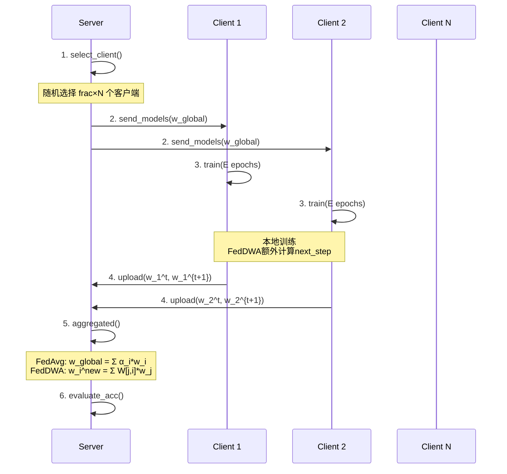

# FedDWA 联邦学习框架 - 模型架构总结

## 📚 项目概述

**研究来源**: IJCAI 2023 论文  
**论文标题**: FedDWA: Personalized Federated Learning with Dynamic Weight Adjustment  
**核心目标**: 个性化联邦学习 (Personalized Federated Learning)  
**主要创新**: 动态权重调整 (Dynamic Weight Adjustment)

### 支持的联邦学习算法

1. **FedDWA** - 动态权重聚合 (本项目核心)
2. **FedAvg** - 联邦平均 (基线方法)
3. **FedProx** - 近端正则化
4. **FedNova** - 归一化平均
5. **FedSAM** - 锐度感知最小化
6. **MOON** - 模型对比学习

---

## 🏗️ 整体系统架构

### 三层架构设计

#### 1️⃣ Server Layer (服务器层)
- **职责**: 客户端选择、模型聚合、全局协调
- **核心类**:
  - `ServerBase`: 基础服务器类，实现通用功能
  - `FedDWA/FedAvg/FedProx/...`: 算法特定实现
- **主要方法**:
  - `dataset_division()`: 数据集划分与Non-IID分配
  - `select_client()`: 客户端选择策略
  - `send_models()`: 向客户端分发模型
  - `receive_models()`: 接收客户端更新
  - `aggregated()`: 模型聚合
  - `evaluate_acc()`: 评估准确率

#### 2️⃣ Client Layer (客户端层)
- **职责**: 执行本地训练、模型更新
- **核心类**:
  - `ClientBase`: 基础客户端类
  - `ClientFedDWA`: 支持两步模型预测
- **主要方法**:
  - `train()`: 本地训练
  - `receive_models()`: 接收全局模型
  - `test_accuracy()`: 测试准确率
  - `train_accuracy()`: 训练准确率

#### 3️⃣ Model Layer (模型层)
- **职责**: 提供多种神经网络架构
- **支持范围**: 从简单CNN到Transformer全覆盖

---

## 💡 FedDWA 核心算法

### 算法思想

**动态权重调整 (Dynamic Weight Adjustment)** 的核心是为每个客户端计算个性化的聚合权重，基于模型相似度选择最相关的邻居。

### 算法流程

```
For each global round t:
  1. Server选择K个客户端参与训练
  2. Server向每个客户端i发送模型 w_i^{t-1}
  
  3. Client i 进行本地训练:
     - 在本地数据上训练E个epoch → 得到 w_i^t
     - 额外训练1步 → 得到 w_i^{t+1} (next_step_model)
  
  4. Client i 上传 (w_i^t, w_i^{t+1}) 到Server
  
  5. Server计算最优权重矩阵 W:
     W[j,i] ∝ 1 / ||w_i^{t+1} - w_j^t||²
     
  6. 列归一化 + Top-K剪枝:
     - 对每一列归一化使得 Σ_j W[j,i] = 1
     - 只保留Top-K个最大权重，其余设为0
     - 再次归一化
  
  7. 个性化聚合:
     w_i^{new} = Σ_{j∈Top-K} W[j,i] * w_j^t
  
  8. 下一轮发送 w_i^{new} 给客户端i
```

### 关键参数

- `feddwa_topk`: Top-K邻居数 (默认5)
- `next_round`: 下一步预测轮数 (默认1)

### 与FedAvg对比

| 特性 | FedAvg | FedDWA |
|------|--------|--------|
| 聚合方式 | 全局统一权重 (数据量加权) | 个性化权重 (模型相似度) |
| 发送模型 | 所有客户端收到相同模型 | 每个客户端收到不同模型 |
| 通信开销 | 1× (单向模型) | 2× (需要next_step_model) |
| Non-IID适应性 | 一般 | 强 |

---

## 🧱 支持的模型架构

### 1. 基础卷积神经网络

#### CIFAR10Model / CIFAR100Model
```
架构:
  Conv2d(3→32, k=3, p=1) → BN → ReLU → MaxPool(2×2)
  Conv2d(32→64, k=3, p=1) → BN → ReLU → MaxPool(2×2)
  Flatten → FC(2304→512) → ReLU → Dropout(0.5)
  FC(512→num_classes)

参数量: ~2.3M
特点: 支持Head/Body分离 (用于个性化联邦学习)
```

#### FedAvgCNN
```
经典联邦学习基线模型
Conv2d(in_channels→32, k=5) → ReLU → MaxPool
Conv2d(32→64, k=5) → ReLU → MaxPool
Flatten → FC(dim→512) → ReLU → FC(512→num_classes)
```

### 2. 残差网络

#### ResNet8 / ResNet18
```
支持数据集: CIFAR-10/100, Tiny-ImageNet, GPR Custom
特点: 
  - 使用残差块 (ResBlock)
  - 支持预训练权重 (zero_init_residual=True)
  - 自适应平均池化 (AdaptiveAvgPool2d)
```

### 3. 现代高效架构

#### MobileViT (Vision Transformer for Mobile)
```python
self.model = timm.create_model('mobilevit_s', 
                                pretrained=True, 
                                num_classes=num_classes)

GPR模式增强:
  self.gpr_preprocess = nn.Sequential(
      InstanceNorm2d(3, affine=True),      # 可学习的信号归一化
      Conv2d(3→16, k=(5,1), p=(2,0)),      # 时间域增强(垂直)
      BatchNorm2d(16) → ReLU,
      Conv2d(16→16, k=(1,5), p=(0,2)),     # 空间域增强(水平)
      BatchNorm2d(16) → ReLU,
      Conv2d(16→3, k=1),                   # 融合回3通道
      BatchNorm2d(3)
  )

参数量: ~5M
特点: 轻量级、适合移动端部署
```

#### EfficientNet-B0
```python
self.model = timm.create_model('tf_efficientnet_b0', 
                                pretrained=False, 
                                num_classes=num_classes)

参数量: ~5M
特点: 复合缩放策略优化深度/宽度/分辨率
```

### 4. 前沿多模态架构

#### FedCLIP (CLIP for Federated Learning)

**核心架构**:
```
1. CLIP Backbone (冻结, ~87M参数):
   ├── Image Encoder: ViT-B/32 or ViT-L/14
   └── Text Encoder: Transformer

2. Trainable Adapter (~0.5M参数):
   fea_attn = Sequential(
       MaskedMLP(dim, dim),
       BatchNorm1d(dim),
       ReLU(),
       MaskedMLP(dim, dim),
       Softmax(dim=1)
   )

3. CoOp (Context Optimization) [可选]:
   PromptLearner: 学习 n_ctx=16 个上下文向量
```

**MaskedMLP 详解**:
```python
class MaskedMLP(nn.Module):
    """稀疏自适应全连接层"""
    def __init__(self, in_size, out_size):
        self.weight = nn.Parameter(Tensor(out_size, in_size))
        self.bias = nn.Parameter(Tensor(out_size))
        self.threshold = nn.Parameter(Tensor(out_size))  # 可学习阈值
    
    def mask_generation(self):
        # 二值化: 只保留 |weight| > threshold 的连接
        abs_weight = torch.abs(self.weight)
        mask = BinaryStep(abs_weight - self.threshold)
        return mask
    
    def forward(self, x):
        mask = self.mask_generation()
        masked_weight = self.weight * mask
        return F.linear(x, masked_weight, self.bias)
```

**CoOp 物理先验初始化** (GPR专用):
```python
gpr_init_text = "GPR B-scan signal showing subsurface dielectric reflection"

# 将物理描述编码为 Embedding
tokenized_init = clip.tokenize(gpr_init_text)
embedding = clip_model.token_embedding(tokenized_init)

# 用物理向量初始化前n_init个上下文
ctx_vectors[:n_init, :] = embedding[0, 1:1+n_init, :]
```

**Prompt Ensemble**:
```python
# 自定义GPR描述 (专家知识)
custom_gpr_prompts = {
    "Crack": [
        "GPR B-scan showing a hyperbolic reflection from a crack",
        "discontinuity in subsurface layers indicating a fracture"
    ],
    # ... 8类别，每类3-5个描述
}

# 通用模板
templates = [
    "a ground penetrating radar image showing {}",
    "a GPR B-scan of {}",
    # ... 6个模板
]

# 混合专家知识与通用模板
final_prompts = custom_prompts[class_name] + template_prompts
text_features = clip.encode_text(final_prompts).mean(dim=0)
```

**前向传播**:
```python
def forward(self, x):
    # 1. CLIP编码图像 (冻结)
    image_features = self.model.encode_image(x).float()
    
    # 2. Adapter注意力
    attn_weights = self.fea_attn(image_features)
    image_features = torch.mul(attn_weights, image_features)
    
    # 3. 归一化
    image_features = F.normalize(image_features, dim=1)
    
    # 4. 计算相似度 (Logits)
    text_features = self.get_text_features()  # 来自Prompt或CoOp
    logit_scale = self.model.logit_scale.exp()
    logits = logit_scale * (image_features @ text_features.t())
    
    return logits
```

---

#### GPR-FedSense (Ground Penetrating Radar 专用)

**三层分离式架构**:

```
┌─────────────────────────────────────────────────┐
│  Module 1: 本地私有层 (不参与联邦聚合)           │
├─────────────────────────────────────────────────┤
│  GPRSignalNorm:                                 │
│    - 可学习的 gamma, beta, gain                │
│    - 实例归一化 (适配设备差异)                  │
│                                                 │
│  GPRFeatureExtractor:                           │
│    ├─ Stage1: Conv → BN → ReLU (浅层特征)      │
│    ├─ TimeConv: (5×1) 垂直卷积 (深度反射)      │
│    ├─ SpatialConv: (1×5) 水平卷积 (横向延续)   │
│    └─ Fusion: Concat → Conv1×1                 │
│  输出: 128维特征                                 │
└─────────────────────────────────────────────────┘
                       ↓
┌─────────────────────────────────────────────────┐
│  Module 2: 全局共享层 (联邦聚合)                 │
├─────────────────────────────────────────────────┤
│  支持三种Backbone:                              │
│    1. CNN: Conv(256) → Conv(512) → AvgPool     │
│    2. ResNet18: 标准ResNet-18 (修改第一层)      │
│    3. MobileViT: timm.mobilevitv2_050          │
│  输出: 512维语义特征                             │
└─────────────────────────────────────────────────┘
                       ↓
┌─────────────────────────────────────────────────┐
│  Module 3: 个性化分类头 (ALA自适应聚合)          │
├─────────────────────────────────────────────────┤
│  Dropout(0.2) → FC(512→256) → ReLU             │
│  Dropout(0.1) → FC(256→8)                      │
└─────────────────────────────────────────────────┘
```

**设计理念**:
1. **本地私有层**: 适配不同设备的信号特性 (增益、噪声、采样率不同)
2. **全局共享层**: 学习通用的地下目标特征 (跨设备知识共享)
3. **个性化分类头**: 处理Non-IID数据分布 (每个场地类别分布不同)

**时空特征提取器详解**:
```python
class GPRFeatureExtractor(nn.Module):
    def forward(self, x):
        # 信号归一化 (适配设备)
        x = self.signal_norm(x)  # [B, 3, H, W]
        
        # 浅层纹理特征
        x = self.stage1(x)  # [B, 64, H, W]
        
        # 并行提取时空特征
        time_feat = self.time_conv(x)     # [B, 64, H, W] 垂直卷积
        spatial_feat = self.spatial_conv(x)  # [B, 64, H, W] 水平卷积
        
        # 特征融合
        x = torch.cat([time_feat, spatial_feat], dim=1)  # [B, 128, H, W]
        x = self.fusion(x)  # [B, 128, H, W]
        
        return x
```

**FedDWA接口实现**:
```python
def get_head_val(self):
    """获取分类头参数 (用于个性化聚合)"""
    return [copy.deepcopy(p) for p in self.classifier.parameters()]

def get_body_val(self):
    """获取共享层参数 (用于全局聚合)"""
    return [copy.deepcopy(p) for p in self.shared_backbone.parameters()]

def get_local_val(self):
    """获取本地私有层参数 (不参与聚合)"""
    return [copy.deepcopy(p) for p in self.local_extractor.parameters()]
```

---

## 🔄 客户端-服务器交互流程

### 单轮训练流程



### FedDWA特殊流程

```python
# Client端
class ClientFedDWA:
    def train(self):
        # Step 1: 正常训练E个epoch
        for epoch in range(self.E):
            for batch in self.train_loader:
                loss = self.train_one_step(batch)
        
        # Step 2: 保存当前模型参数
        self.model_params_t = copy.deepcopy(self.model.state_dict())
        
        # Step 3: 额外训练next_round步
        for _ in range(self.next_round):
            for batch in self.train_loader:
                loss = self.train_one_step(batch)
        
        # Step 4: 保存下一步模型参数
        self.next_step_model = copy.deepcopy(self.model.state_dict())
        
        # Step 5: 恢复到t时刻模型 (用于评估)
        self.model.load_state_dict(self.model_params_t)
        
        return loss

# Server端
class FedDWA:
    def cal_optimal_weight(self):
        """计算最优权重矩阵"""
        W = np.zeros([K, K])  # K = len(selected_clients)
        
        # 计算相似度矩阵
        for i in range(K):
            for j in range(K):
                # W[j,i] = 1 / ||w_i^{t+1} - w_j^t||²
                diff = self.flatten(next_models[i]) - self.flatten(current_models[j])
                W[j,i] = 1.0 / (torch.norm(diff)**2)
        
        # 列归一化
        W = self.column_normalization(W)
        
        # Top-K选择
        W = self.column_top_k(W, K=self.feddwa_topk)
        
        # 再次归一化
        W = self.column_normalization(W)
        
        return W
    
    def aggregated(self, W):
        """个性化聚合"""
        for i in range(K):
            w_i_new = {}
            for param_name in model_params:
                w_i_new[param_name] = sum(
                    W[j,i] * current_models[j][param_name]
                    for j in range(K)
                )
            self.send_client_models[i] = w_i_new
```

---

## 📊 数据处理与Non-IID设置

### 支持的数据集

| 数据集 | 类别数 | 训练集 | 测试集 | 图像尺寸 |
|--------|--------|--------|--------|----------|
| CIFAR-10 | 10 | 50,000 | 10,000 | 32×32×3 |
| CIFAR-100 | 100 | 50,000 | 10,000 | 32×32×3 |
| CINIC-10 | 10 | 90,000 | 90,000 | 32×32×3 |
| Tiny-ImageNet | 200 | 100,000 | 10,000 | 64×64×3 |
| GPR Custom | 8 | 自定义 | 自定义 | 224×224×3 |

### Non-IID分布类型

#### Type 8 - 病态异构 (Pathological Non-IID)
```python
def noniid_type8(dataset, num_users):
    """
    每个客户端只有2个类别的数据
    例: Client 0 → [类别0, 类别1]
        Client 1 → [类别1, 类别2]
        ...
    极端Non-IID，模拟最坏情况
    """
    shards_per_user = 2
    num_shards = num_users * shards_per_user
    idx_shard = list(range(num_shards))
    
    # 为每个客户端分配shard
    dict_users = {i: np.array([]) for i in range(num_users)}
    for i in range(num_users):
        rand_set = set(np.random.choice(idx_shard, shards_per_user, replace=False))
        idx_shard = list(set(idx_shard) - rand_set)
        dict_users[i] = np.concatenate([shards[idx] for idx in rand_set])
```

#### Type 9 - Dirichlet分布 (Practical Non-IID 1)
```python
def noniid_type9(dataset, num_users, num_classes, dirichlet_alpha=0.1):
    """
    使用Dirichlet(α)分布分配数据
    α越小，Non-IID程度越高
    
    α = 0.1: 高度Non-IID (每个客户端数据严重偏斜)
    α = 1.0: 中度Non-IID
    α = 10.0: 接近IID
    """
    label_distribution = np.random.dirichlet([dirichlet_alpha]*num_users, num_classes)
    # label_distribution[k,i] = 类别k在客户端i的比例
    
    for k in range(num_classes):
        idx_k = np.where(labels == k)[0]
        np.random.shuffle(idx_k)
        
        proportions = label_distribution[k]
        # 按比例分配类别k的样本给各客户端
        proportions = (np.cumsum(proportions) * len(idx_k)).astype(int)[:-1]
        splits = np.split(idx_k, proportions)
        
        for i, split in enumerate(splits):
            dict_users[i] = np.concatenate([dict_users[i], split])
```

#### Type 10 - 类别数+比例 (Practical Non-IID 2)
```python
def noniid_type10(dataset, num_users, num_types=4, ratio=0.8):
    """
    每个客户端:
      - 主导类别: num_types 个类，占比 ratio
      - 其余类别: 平均分配剩余的 (1-ratio)
    
    例: num_types=4, ratio=0.8, num_classes=10
      Client 0: [类0,1,2,3] 占80%, [类4,5,6,7,8,9] 占20%
    
    模拟真实场景 (某些类别更常见)
    """
    main_classes = np.random.choice(num_classes, num_types, replace=False)
    other_classes = set(range(num_classes)) - set(main_classes)
    
    # 分配80%给主导类别
    main_samples = int(total_samples * ratio / num_types)
    other_samples = int(total_samples * (1-ratio) / len(other_classes))
    
    for c in main_classes:
        dict_users[i] = np.concatenate([dict_users[i], idx_class[c][:main_samples]])
    for c in other_classes:
        dict_users[i] = np.concatenate([dict_users[i], idx_class[c][:other_samples]])
```

---

## 🚀 高级优化策略

### 1. FedVLS (Vacant-class Distillation)

**问题**: Non-IID场景下，客户端可能缺失某些类别的数据  
**解决**: 使用全局模型作为教师，对本地缺失类别进行知识蒸馏

```python
def compute_fedvls_loss(student_output, teacher_output, local_labels, num_classes):
    """
    student_output: 本地模型输出 [B, C]
    teacher_output: 全局模型输出 [B, C]
    local_labels: 本地真实标签 [B]
    """
    # 找出本地存在的类别
    present_classes = torch.unique(local_labels)
    vacant_classes = [c for c in range(num_classes) if c not in present_classes]
    
    # 对空置类别进行蒸馏
    distill_loss = 0
    for c in vacant_classes:
        # KL散度: 学生在类别c上的预测分布 应接近 教师
        distill_loss += F.kl_div(
            F.log_softmax(student_output[:, c], dim=0),
            F.softmax(teacher_output[:, c], dim=0)
        )
    
    return distill_loss

# 总损失
loss = ce_loss + fedvls_alpha * fedvls_loss
```

**参数**:
- `--use_fedvls`: 启用FedVLS
- `--fedvls_alpha`: 蒸馏损失权重 (默认1.0)

### 2. FedDecorr (Feature Decorrelation)

**问题**: 特征之间的相关性导致冗余，降低模型泛化能力  
**解决**: 添加去相关约束，鼓励特征正交

```python
def compute_feddecorr_loss(features):
    """
    features: 模型中间层特征 [B, D]
    目标: 使特征的协方差矩阵接近单位矩阵
    """
    # 1. 归一化特征
    features = F.normalize(features, dim=1)  # [B, D]
    
    # 2. 计算协方差矩阵
    cov = features.T @ features / features.size(0)  # [D, D]
    
    # 3. 去相关损失 (希望非对角线元素为0)
    decorr_loss = (cov ** 2).sum() - (cov.diag() ** 2).sum()
    
    return decorr_loss

# 总损失
loss = ce_loss + feddecorr_beta * decorr_loss
```

**参数**:
- `--use_feddecorr`: 启用FedDecorr
- `--feddecorr_beta`: 去相关损失权重 (默认0.1)

**适用场景**: GPR-FedSense模型，在`get_features()`返回的特征上应用

### 3. ALA (Adaptive Layer Aggregation)

**问题**: 不同层对Non-IID的敏感度不同 (浅层更通用，深层更个性化)  
**解决**: 为不同层学习自适应聚合权重

```python
class ALA:
    def __init__(self, model, rand_percent=80, layer_idx=0, eta=1.0):
        self.rand_percent = rand_percent
        self.layer_idx = layer_idx
        self.eta = eta  # 权重学习率
        
        # 为每一层初始化权重
        self.weights = {name: 1.0 for name, _ in model.named_parameters()}
    
    def adaptive_aggregate(self, global_params, local_params, train_loader):
        """
        为每一层学习权重 w_l ∈ [0,1]
        新参数 = w_l * global_params + (1 - w_l) * local_params
        """
        # 1. 采样本地数据 (rand_percent%)
        sample_data = self.sample_data(train_loader, self.rand_percent)
        
        # 2. 对每一层计算梯度
        for name, param in model.named_parameters():
            if self.should_aggregate_layer(name):
                # 计算该层权重的梯度
                grad = self.compute_weight_gradient(name, sample_data)
                
                # 更新权重 (梯度上升)
                self.weights[name] += self.eta * grad
                self.weights[name] = np.clip(self.weights[name], 0, 1)
        
        # 3. 应用权重聚合
        for name, param in model.named_parameters():
            w = self.weights[name]
            param.data = w * global_params[name] + (1 - w) * local_params[name]
```

**参数**:
- `--rand_percent`: 采样比例 (默认80%)
- `--layer_idx`: 控制权重范围 (从第几层开始聚合)
- `--eta`: 权重学习率 (默认1.0)

### 4. Learning Rate Decay

**策略**: 随着训练进行，逐渐降低学习率

```python
def adjust_learning_rate(optimizer, round_idx, lr_decay, lr_decay_step):
    """
    lr_t = lr_0 * (lr_decay)^{round_idx // lr_decay_step}
    """
    decay_factor = lr_decay ** (round_idx // lr_decay_step)
    new_lr = args.lr * decay_factor
    
    for param_group in optimizer.param_groups:
        param_group['lr'] = new_lr
```

**参数**:
- `--lr_decay`: 衰减因子 (默认1.0, 即不衰减)
- `--lr_decay_step`: 每N轮衰减一次 (默认10)

---

## 📈 实验配置与结果

### 主要超参数

```bash
# 全局参数
--Tg 100                # 全局通信轮数
--client_num 20         # 客户端总数
--client_frac 0.5       # 每轮参与比例 (10个客户端)

# 本地训练
--E 1                   # 本地训练epoch数
--B 20                  # 本地batch size
--lr 0.01               # 学习率
--weight_decay 0.0      # L2正则化

# FedDWA特定
--feddwa_topk 5         # Top-K邻居数
--next_round 1          # 下一步预测轮数

# Non-IID设置
--non_iidtype 9         # 使用Dirichlet分布
--alpha_dir 0.1         # Dirichlet参数 (越小越Non-IID)

# 其他算法参数
--mu 0.01               # FedProx近端项权重
--sam_rho 0.05          # FedSAM扰动半径
--moon_mu 5.0           # MOON对比损失权重
```

### 运行示例

```bash
# FedDWA on CIFAR-10
python main.py \
    --alg feddwa \
    --dataset cifar10tpds \
    --model cnn \
    --Tg 100 \
    --client_num 20 \
    --client_frac 0.5 \
    --feddwa_topk 5 \
    --E 1 --B 20 --lr 0.01 \
    --non_iidtype 9 --alpha_dir 0.1

# FedCLIP with CoOp on GPR
python main.py \
    --alg feddwa \
    --dataset gpr_custom \
    --model fedclip \
    --use_coop --n_ctx 16 \
    --Tg 100 \
    --lr 0.001

# GPR-FedSense with FedVLS + FedDecorr
python main.py \
    --alg feddwa \
    --dataset gpr_custom \
    --model gpr_fed \
    --gpr_backbone resnet18 \
    --use_fedvls --fedvls_alpha 1.0 \
    --use_feddecorr --feddecorr_beta 0.1 \
    --Tg 100
```

### 结果保存

```
logs_feddwa/
├── cifar10tpds_feddwa_model=cnn_..._12345.json     # 测试准确率、训练损失
├── cifar10tpds_feddwa_model=cnn_..._results.csv    # 详细逐轮结果
├── cifar10tpds_feddwa_model=cnn_..._model_structure.json
└── client_confusion_matrices/
    ├── confusion_matrix_client_0.png
    ├── confusion_matrix_client_1.png
    └── ...
```

**CSV格式**:
```
Round, Global_Train_Acc, Weighted_Mean_Acc, Round_Duration, Learning_Rate, Client_0_Test_Acc, Client_1_Test_Acc, ...
1, 0.4523, 0.4234, 12.34, 0.01, 0.45, 0.42, ...
2, 0.5123, 0.4934, 11.98, 0.01, 0.52, 0.49, ...
...
```

---

## 🌐 应用场景

### 1. 医疗健康 (Healthcare)
- **场景**: 多家医院协同训练疾病诊断模型
- **挑战**: 患者隐私、医院间数据分布差异大
- **解决**: 
  - FedDWA: 为每家医院提供个性化模型
  - FedCLIP: 医学图像+报告联合学习
  - FedVLS: 处理罕见病 (某些医院缺失数据)

### 2. 智能交通 (Intelligent Transportation)
- **场景**: 自动驾驶车辆间协同感知
- **挑战**: 不同地区天气/路况差异、设备异构
- **解决**:
  - GPR-FedSense: 路面缺陷检测 (探地雷达)
  - 本地私有层: 适配不同车载设备

### 3. 金融风控 (Finance)
- **场景**: 银行间协作反欺诈模型训练
- **挑战**: 客户隐私、欺诈模式地区差异
- **解决**:
  - FedProx: 近端正则化防止模型偏移
  - FedDWA: 为每家银行定制风控策略

### 4. 工业检测 (Industrial Inspection)
- **场景**: 探地雷达、无损检测设备间知识共享
- **挑战**: 设备厂商不同、信号特性差异大
- **解决**:
  - GPR-FedSense: 三层架构 (本地+共享+个性化)
  - 信号归一化: 适配不同设备

---

## 🔮 未来工作方向

### 1. 隐私保护增强
- **差分隐私 (Differential Privacy)**:
  ```python
  # 在梯度中添加高斯噪声
  gradient += torch.randn_like(gradient) * noise_scale
  ```
- **同态加密 (Homomorphic Encryption)**: 允许在加密数据上直接计算
- **安全多方计算 (SMPC)**: 多方联合计算而不泄露原始数据

### 2. 模型压缩
- **知识蒸馏 (Knowledge Distillation)**: 训练小模型模仿大模型
- **模型剪枝 (Pruning)**: 移除冗余参数 (已实现MaskedMLP)
- **量化 (Quantization)**: 降低参数精度 (FP32 → INT8)

### 3. 通信优化
- **梯度压缩 (Gradient Compression)**:
  ```python
  # Top-K Sparsification
  k = int(0.1 * gradient.numel())
  topk_values, topk_indices = torch.topk(gradient.abs().flatten(), k)
  compressed_gradient = torch.sparse_coo_tensor(topk_indices, topk_values)
  ```
- **部分参数更新**: 只上传/下载变化的层
- **Over-the-Air Computation**: 利用无线信道特性直接聚合

### 4. 异步联邦学习
- **问题**: 同步FL需等待最慢的客户端 (straggler problem)
- **解决**: 异步聚合 + 时间戳校正
  ```python
  # 异步FedAvg
  def async_aggregate(self, new_model, timestamp):
      staleness = current_time - timestamp
      weight = 1.0 / (1 + staleness)  # 越旧权重越小
      self.global_model = weight * new_model + (1-weight) * self.global_model
  ```

### 5. 多任务联邦学习
- 同时训练分类、检测、分割等多个任务
- 共享底层表示，任务特定头

### 6. 跨域联邦学习
- **域适应 (Domain Adaptation)**: 处理不同数据分布
- **迁移学习 (Transfer Learning)**: 从一个任务迁移到另一个任务

---

## 📚 技术栈 (Tech Stack)

### 深度学习框架
- **PyTorch** 2.0+: 核心训练框架
- **torchvision**: 视觉模型与数据集
- **timm** (PyTorch Image Models): 预训练模型库
- **CLIP** (OpenAI): 多模态预训练模型

### 科学计算
- **NumPy**: 数值计算
- **scikit-learn**: 评估指标 (混淆矩阵、准确率)

### 可视化
- **matplotlib**: 基础绘图
- **seaborn**: 统计可视化 (混淆矩阵热力图)

### 数据处理
- **h5py**: HDF5数据格式
- **Pillow**: 图像处理

### 其他
- **pathlib**: 路径管理
- **argparse**: 命令行参数解析
- **logging**: 日志记录

---

## 💡 关键创新点总结

### 1️⃣ FedDWA算法
- **动态权重聚合**: 基于模型相似度计算个性化权重
- **Top-K机制**: 只保留最相关的K个邻居，提高聚合效率
- **两步训练**: 通过next_step_model预测未来状态，更好地选择邻居

### 2️⃣ 多模态联邦学习 (FedCLIP)
- **首次将CLIP引入联邦学习**: 利用预训练的视觉-语言对齐
- **CoOp物理先验初始化**: 用领域知识 (GPR B-scan...) 初始化上下文
- **MaskedMLP稀疏适配**: 动态生成掩码，减少参数量和过拟合
- **Prompt Ensemble**: 混合专家知识与通用模板，提升鲁棒性

### 3️⃣ 专用领域适配 (GPR-FedSense)
- **三层分离架构**: 本地私有层 + 全局共享层 + 个性化头
- **时空特征提取**: 并行的时间域 (5×1) 和空间域 (1×5) 卷积
- **信号归一化**: 可学习的gamma/beta/gain，适配不同设备
- **支持FedVLS和FedDecorr**: 处理类别缺失和特征冗余

### 4️⃣ 全面的算法对比框架
- **统一接口**: 所有算法共享ServerBase和ClientBase
- **6种算法**: FedDWA, FedAvg, FedProx, FedNova, FedSAM, MOON
- **易于扩展**: 只需继承Base类并实现`aggregated()`方法

### 5️⃣ 严谨的实验设计
- **3种Non-IID类型**: Pathological, Dirichlet, 类别数+比例
- **完善的评估**: 测试准确率、训练损失、混淆矩阵、训练曲线
- **自动化**: 一键运行 + 自动保存结果 + 可视化

---

## 📊 模型复杂度对比

| 模型 | 参数量 | FLOPs | 输入尺寸 | 适用场景 |
|------|--------|-------|----------|----------|
| CIFAR10Model | 2.3M | ~0.5G | 32×32 | 轻量级分类 |
| FedAvgCNN | 1.2M | ~0.3G | 32×32 | 基线对比 |
| ResNet18 | 11M | ~1.8G | 224×224 | 通用视觉任务 |
| MobileViT-S | 5M | ~2.0G | 224×224 | 移动端部署 |
| EfficientNet-B0 | 5M | ~0.4G | 224×224 | 高效推理 |
| FedCLIP (ViT-B/32) | 87M (冻结) + 0.5M (可训练) | ~4.4G | 224×224 | 多模态学习 |
| GPR-FedSense (CNN) | 3M | ~0.8G | 224×224 | 探地雷达 |
| GPR-FedSense (ResNet18) | 12M | ~2.2G | 224×224 | 探地雷达 (高精度) |

**注**:
- FLOPs 基于单张图像前向传播计算
- FedCLIP的87M参数来自CLIP backbone (冻结)，实际训练只需要0.5M参数
- GPR-FedSense的参数量取决于选择的backbone

---

## 🎓 代码组织结构

```
FedDWA/
├── main.py                      # 主入口，参数解析
├── requirements.txt             # 依赖库
├── script.sh                    # 批量实验脚本
├── readme.md                    # 项目说明
│
├── servers/                     # 服务器实现
│   ├── serverBase.py            # 基础服务器类
│   ├── serverFedDWA.py          # FedDWA服务器
│   ├── serverFedAvg.py          # FedAvg服务器
│   ├── serverFedProx.py         # FedProx服务器
│   ├── serverFedNova.py         # FedNova服务器
│   ├── serverFedSAM.py          # FedSAM服务器
│   └── serverMOON.py            # MOON服务器
│
├── clients/                     # 客户端实现
│   ├── clientBase.py            # 基础客户端类
│   ├── clientFedDWA.py          # FedDWA客户端 (两步训练)
│   ├── clientFedAvg.py          # FedAvg客户端
│   ├── clientFedProx.py         # FedProx客户端 (近端项)
│   ├── clientFedNova.py         # FedNova客户端 (归一化)
│   ├── clientFedSAM.py          # FedSAM客户端 (锐度感知)
│   └── clientMOON.py            # MOON客户端 (对比学习)
│
├── model/                       # 模型定义
│   ├── MLModel.py               # 所有模型定义 (1746行)
│   │   ├── 基础模型 (CNN, MLP, ResNet)
│   │   ├── MobileViT (Vision Transformer)
│   │   ├── FedCLIP (多模态)
│   │   └── GPR-FedSense (探地雷达)
│   └── myresnet.py              # ResNet变体
│
├── utils/                       # 工具函数
│   ├── data_utils.py            # 数据加载与划分
│   ├── dataset.py               # 自定义数据集类
│   ├── logger.py                # 日志记录
│   └── plot_utils.py            # 可视化工具
│
├── logs_feddwa/                 # 实验日志 (自动生成)
│   ├── *.json                   # 测试准确率、训练损失
│   ├── *.csv                    # 详细逐轮结果
│   ├── *_model_structure.json   # 模型结构
│   └── client_confusion_matrices/  # 混淆矩阵
│
└── data/                        # 数据集目录 (需下载)
    ├── cifar-10-batches-py/
    ├── cifar-100-python/
    └── gpr_custom/
```

---

## 📝 引用

如果您使用本项目的代码或思想，请引用原始论文:

```bibtex
@inproceedings{liu2023feddwa,
  title={FedDWA: Personalized Federated Learning with Dynamic Weight Adjustment},
  author={Liu, Jiahao and Wu, Jiang and Chen, Jinyu and Hu, Miao and Zhou, Yipeng and Wu, Di},
  booktitle={Proceedings of the Thirty-Second International Joint Conference on Artificial Intelligence (IJCAI-23)},
  pages={3980--3988},
  year={2023}
}
```

---

## 📧 联系方式

如有问题或建议，欢迎通过以下方式联系:
- 📧 Email: [请参考原始仓库]
- 🐛 Issues: [GitHub Issues]
- 📝 讨论: [GitHub Discussions]

---

## 📜 许可证

本项目采用 [MIT License](LICENSE) 开源协议。

---

**最后更新**: 2024年12月

**版本**: v1.0

**维护状态**: 积极维护中 ✅
