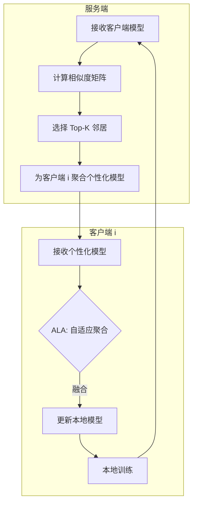

# FedDWA 个性化联邦学习架构分析

## 1. 核心理念：对全局参数的不敏感性
用户正确地指出，**个性化联邦学习 (PFL)** 应该对全局参数不敏感，或者更准确地说，应该**对全局噪声具有鲁棒性**。本地模型不应被全局平均值盲目覆盖，因为全局平均值可能发生漂移或与本地分布无关（非独立同分布 Non-IID）。

## 2. 当前架构概览
目前的 `FedDWA` 实现通过**双层个性化**策略来实现这一点：

### 第一层：服务端个性化 (FedDWA)
- **机制**：服务端不维护单一的全局模型，而是为*每个*客户端计算一个独特的**个性化模型**。
- **逻辑**：
    - 它根据客户端更新之间的相似度（距离）计算 `weight_matrix`（权重矩阵）。
    - 客户端 $i$ 接收的是从其“邻居”（更新相似的客户端）聚合而来的模型，而不是全局平均值。
    - **不敏感性**：通过过滤掉不相似的客户端（使用 Top-K 和基于距离的权重），发送给客户端 $i$ 的模型已经对来自不相关客户端的噪声“不敏感”了。

### 第二层：客户端适应 (ALA - 自适应本地聚合)
- **机制**：当客户端收到来自服务端的模型时（即使是个性化的），它**不会**立即覆盖其本地模型。
- **逻辑**：
    - 它使用 **ALA (自适应本地聚合)**。
    - ALA 训练一个临时本地模型来学习权重参数 $\lambda$。
    - 更新公式为：$W_{local} = (1-\lambda) W_{local} + \lambda W_{received}$。
    - **不敏感性**：如果接收到的模型有害（在本地数据上损失很高），ALA 将学习到一个很小的 $\lambda$，从而有效地拒绝该更新。

## 3. 代码重组与重构计划
为了使这个架构更清晰、更健壮，我们将执行以下清理工作：

### A. 服务端 (`servers/serverFedDWA.py`)
1.  **移除死代码**：删除注释掉的权重计算实现尝试。
2.  **阐明聚合逻辑**：添加注释，解释 `aggregated` 计算客户端的特定模型，而全局模型更新*仅*用于评估目的。
3.  **效率**：确保我们只处理所需的梯度/参数。

### B. 客户端 (`clients/clientFedDWA.py`)
1.  **明确把关**：确保 `receive_models` 是外部参数进入的*唯一*入口。
2.  **ALA 集成**：验证 ALA 是否处于活动状态并记录其活动（可选，但有助于调试）。

### C. 架构图（概念）

